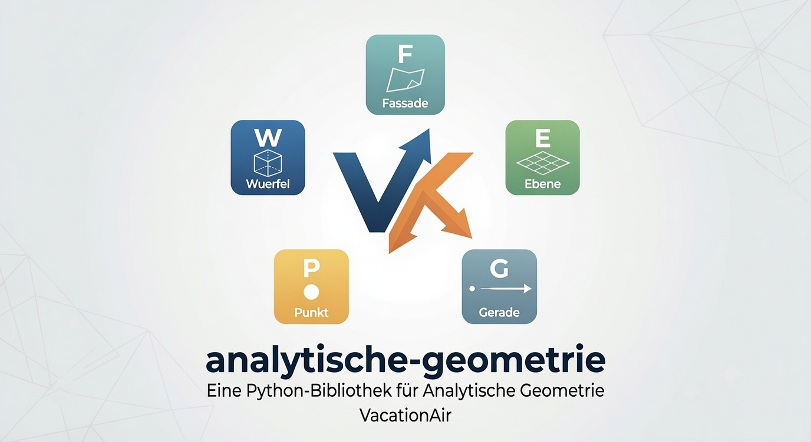

<p align="center">
  
</p>

<p align="center">


</p>

# Analytische Geometrie

**Analytische Geometrie** ist eine vollständig in **Pure Python** entwickelte Bibliothek für Berechnungen der analytischen Geometrie im dreidimensionalen Raum. Sie verfügt über einen eigenen Vektor- und Linear-Algebra-Kern und bietet eine objektorientierte API für **Vektoren, Punkte, Geraden, Ebenen und Fassaden** einschließlich geometrischer Transformationen wie **Skalierung, Rotation, Verschiebung und Spiegelung**.

Die Bibliothek besitzt keinerlei externe Abhängigkeiten und eignet sich sowohl für Lehre und Studium als auch als Grundlage für geometrische Anwendungen, Visualisierung oder CAD-nahe Projekte.

---

# Funktionen

## Vektoren (`Vektor`)

* Vektoraddition und -subtraktion
* Skalarmultiplikation
* Betrag
* Skalarprodukt
* Kreuzprodukt
* Normierung
* Winkelberechnung
* Transformationen

  * Skalieren
  * Verschieben
  * Drehen
  * Spiegeln an Punkt
  * Spiegeln an Gerade
  * Spiegeln an Ebene

---

## Punkte (`Punkt`)

* Erstellung von Punkten im ℝ³
* Abstand zwischen Punkten
* Richtungsvektor zwischen zwei Punkten
* Alle geometrischen Transformationen

---

## Geraden (`Gerade`)

* Erstellung aus

  * zwei Punkten
  * Stütz- und Richtungsvektor
* Berechnung beliebiger Punkte auf der Geraden
* Lotfußpunkt eines Punktes
* Spurpunkte
* Abstände zu

  * Punkten
  * Geraden
* Schnittpunkt mit Geraden
* Lagebeziehungen

  * identisch
  * parallel
  * schneidend
  * windschief
* Winkelberechnungen
* Geometrische Transformationen

---

## Ebenen (`Ebene`)

* Erstellung aus

  * Punkt und Normalenvektor
  * Punkt und zwei Spannvektoren
* Lotfußpunkt eines Punktes
* Schnittgerade zweier Ebenen
* Schnittpunkt mit Geraden
* Spurpunkte
* Abstände zu

  * Punkten
  * Geraden
  * Ebenen
* Schnittwinkel
* Lagebeziehungen

  * identisch
  * parallel
  * schneidend
* Geometrische Transformationen

---

## Fassaden (`Fassade`)

Darstellung begrenzter ebener Vierecke.

Unterstützt unter anderem:

* Mittelpunkt
* Umfang
* Flächeninhalt
* Normalenvektor
* Punkt-in-Fassade-Test
* Lagebeziehungen zwischen Fassaden

  * identisch
  * parallel
  * schneidend
  * außerhalb
  * koplanar schneidend
  * koplanar außerhalb
  * auf Kante
  * berührend
  * kanten schneidend
* Abstand zwischen Fassaden
* Schnittpunkt (falls eindeutig)
* Geometrische Transformationen

---

# Eigenschaften

* ✅ Vollständig in **Pure Python**
* ✅ Keine externen Abhängigkeiten
* ✅ Eigener Vektor-Kern
* ✅ Eigene Linear-Algebra-Hilfsfunktionen
* ✅ Objektorientierte API
* ✅ Numerisch robuste Berechnungen mittels eigener Toleranzfunktionen
* ✅ Geometrische Transformationen für alle Objekte
* ✅ Umfangreiche Unit-Tests
* ✅ Für Lehre, Studium und technische Anwendungen geeignet

---

# Installation

```bash
pip install analytische_geometrie
```

---

# 📚 Beispiele

## Grundlegende Geometrie

```python
from analytische_geometrie import Punkt, Gerade

A = Punkt([0, 0, 0])
B = Punkt([2, 2, 2])

g = Gerade.from_punkte(A, B)

print(A.abstand_zu_punkt(B))
print(g.gerade(0.5))
print(g.enthaelt_punkt(A))
```

---

## Ebenen

```python
from analytische_geometrie import Punkt, Ebene

E = Ebene([1, 2, 3], [1, 1, 1])
P = Punkt([4, 5, 6])

print(E.abstand_punkt(P))
print(E.enthaelt_punkt(P))
print(E.spurpunkte())
```

---

## Transformationen

```python
from analytische_geometrie import Gerade

g = Gerade([1, 2, 3], [1, 0, 0])

g2 = g.skalieren(2)
g3 = g.verschieben([5, 0, 0])
g4 = g.drehen(90, "z")
g5 = g.spiegeln_an_punkt([0, 0, 0])
```

---

## Fassade

```python
from analytische_geometrie import Punkt, Fassade

fassade = Fassade(
    [0, 0, 0],
    [10, 0, 0],
    [10, 8, 0],
    [0, 8, 0]
)

print(fassade.flaecheninhalt())
print(fassade.umfang())
print(fassade.mittelpunkt)

P = Punkt([5, 4, 0])
print(fassade.enthaelt_punkt(P))
```

---

## Schnittpunkt zwischen Gerade und Ebene

```python
from analytische_geometrie import Gerade, Ebene

g = Gerade([0, 0, 0], [1, 1, 1])
E = Ebene([1, 0, 0], [0, 1, 0])

print(E.lage_gerade(g))
print(E.schnittpunkt_gerade(g))
```

---

## Winkelberechnungen

```python
from analytische_geometrie import Gerade, Ebene

g1 = Gerade([0, 0, 0], [1, 0, 0])
g2 = Gerade([0, 0, 0], [1, 1, 0])

print(g1.winkel_zwei_geraden(g2, deg=True))

E = Ebene([0, 0, 0], [0, 0, 1])
print(E.schnittwinkel_gerade(g1, deg=True))

E2 = Ebene([0, 0, 0], [1, 1, 0])
print(E.schnittwinkel_ebene(E2, deg=True))
```

---

## Abhängigkeiten

* Python ≥ 3.10

---

## Lizenz

MIT License.